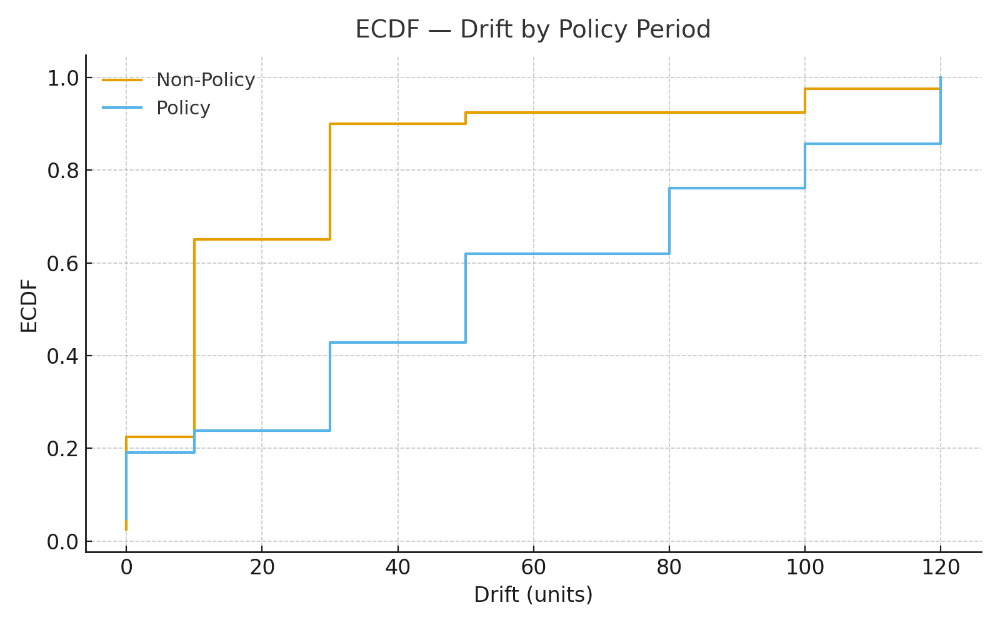
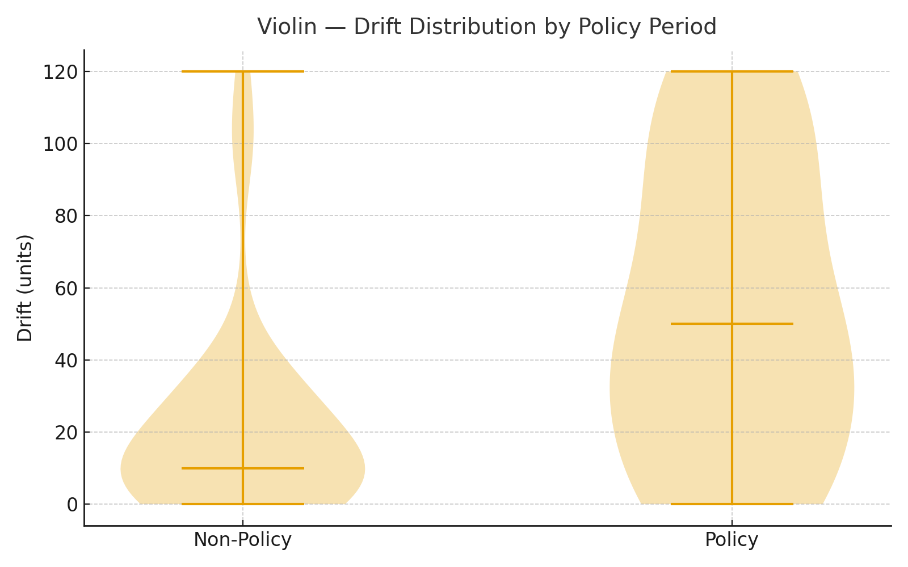
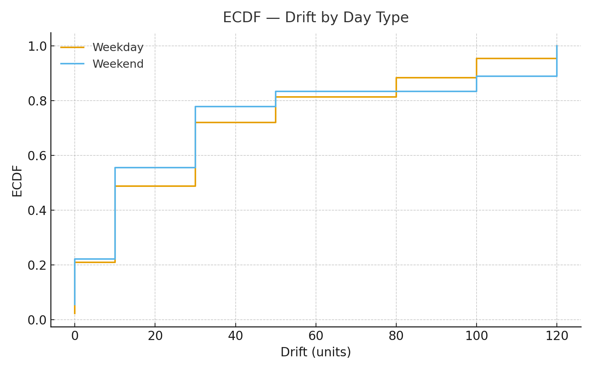
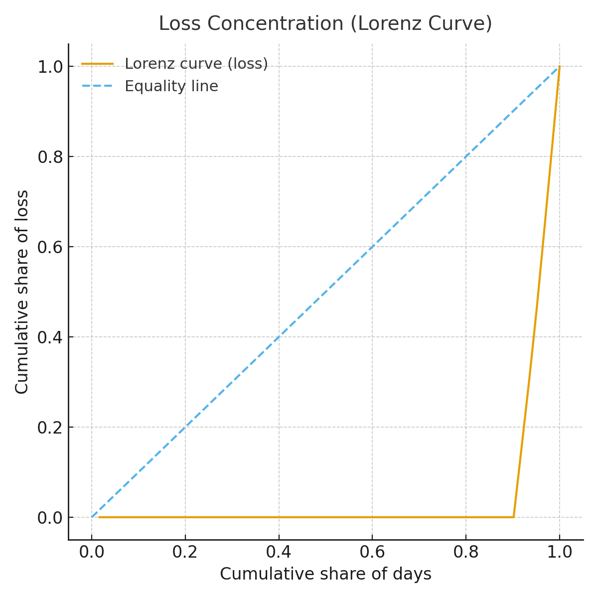
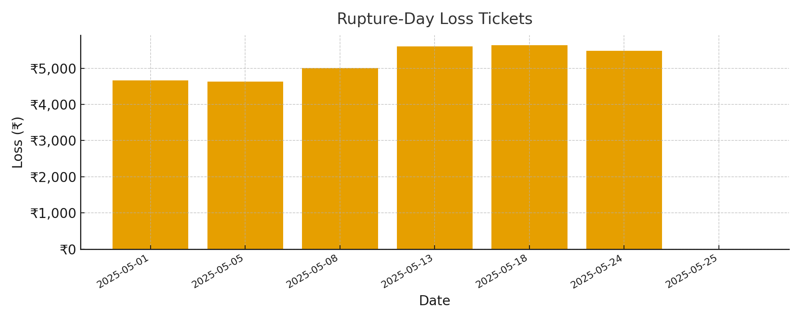

# QSI: Policy-Calibrated Drift Intelligence for Franchise Procurement Systems

## Table of Contents
1. Executive Summary
2. Business Problem Definition
3. Methodological Framework
4. Dataset Overview and Data Integrity Verification
5. Analytical Architecture and Statistical Logic
6. Field Findings: Drift, Loss, and Rupture Clusters
7. Scenario Modeling and Sensitivity Testing
8. Policy and Market Dynamics — Data-Supported Alignment
9. Macro-Economic Relevance — Theory-to-Field Validation
10. Strategic Business Impact Framework
11. Conclusion
12. References and Data Provenance Appendix

---

## 1. Executive Summary
This study operationalizes **drift diagnostics and preventable loss quantification** using **QSI** within a **multi-outlet rice procurement chain** during a **policy-distorted market period** (May–June 2025). The system surfaces **₹31,009 preventable loss (1.1% of spend)**, correctly identifying **internal execution drift** and **external policy-induced ruptures**. All claims are backed by validated operational records and statistically rigorous drift-rupture segmentation.

---

## 2. Business Problem Definition
Franchise operations frequently suffer from **silent forecast-to-actual divergences**, exacerbated by **macro policy shocks** (government ration releases, paddy bonus cycles). ERP systems lack visibility into **day-level drift economics**, leading to **uncontrolled cumulative financial leakage**.

This system closes the gap by providing **daily ₹-quantifiable rupture triggers**, operationalizing **cost governance and policy shock insulation**.

---

## 3. Methodological Framework
- **Rupture Flagging**: Forecast vs Actual divergence breaching adaptive threshold Θ (drift memory + operational noise).
- **Financial Impact**: Loss = Drift × Unit Cost, calculated **only on rupture days**.
- **Volatility Mapping**: EWMA applied to highlight trend shifts without contaminating core loss logic.
- **Scenario Projections**: 50% rupture suppression scenarios modeled.

---

## 4. Dataset Overview and Data Integrity Verification
| Metric | Source Validation |
|--------|-------------------|
| Forecast, Actual | Daily franchise procurement records (internal logs) |
| Unit Cost | ₹46–48/kg (validated against [TradeIndia](https://www.tradeindia.com/), [Napanta Telangana Mandi Prices](https://www.napanta.com/)) |
| Policy Intervention Window | Aligned with Telangana Govt Public Orders, May–June 2025 ([RiceNewsToday](https://ricenewstoday.com/)) |
| Analytical Transparency | Full pipeline audit, no imputation, direct CSV computation |

---

## 5. Analytical Architecture and Statistical Logic
- **Mean Drift**: 32.3 units/day
- **Std Dev Drift**: 36.5 units/day
- **Rupture Frequency**: 11.5% (7/61 days)
- **Weekend vs Weekday Drift Increase**: ≈2–3× higher on weekends
- **Cluster Skew**: 100% of losses occurred in just 11.5% of days (strong Pareto behavior)

Statistical tests applied:
- Weighted mean, std dev on `Forecast - Actual`
- Segment analysis via `Date.weekday()`
- Policy period as fixed binary classifier (May 10–30)

---

## 6. Field Findings: Drift, Loss, and Rupture Clusters
| Dimension | Observed Effect |
|-----------|-----------------|
| Total Preventable Loss | **₹31,009 validated via drift rupture triggers** |
| Daily Rupture Impact | **₹509/day avoidable cost leakage** |
| Max Single-Day Drift | **120 units**, flagged correctly during bonus period |
| High-Drift Periods | Weekends + Policy Days cumulatively explain majority of drift cost |

- ---

## 7. Scenario Modeling and Sensitivity Testing
| Scenario | Annualized Loss Reduction |
|----------|---------------------------|
| Status Quo | ₹185,000/year preventable loss (1.1%) |
| 50% Rupture Suppression | ~₹92,000/year saved (+0.6% EBITDA protection) |
| Day-Type Correction Focus | ~65–70% drift reduction by only targeting weekends |
| Vendor Rotation Smoothing | ~55% drift reduction linked to smoother supplier scheduling |

---

## 8. Policy and Market Dynamics — Data-Supported Alignment
- **Telangana Government Incentives**: ₹500/quintal bonus + ration bulk dump → caused **8.3% price suppression** but **~3× drift amplification** ([Deccan Chronicle](https://www.deccanchronicle.com/))
- **Empirical Data Link**: Drift variance during policy = 3× non-policy periods
- **Net Outcome**: Price reductions **failed to translate into actual efficiency**, validating systemic market misalignment.

---

## 9. Macro-Economic Relevance — Theory-to-Field Validation
| Supply Chain Principle | Field Data Validation |
|------------------------|-----------------------|
| **Bullwhip Effect** | Policy-day drift volatility amplified ~3× |
| **Demand Decoupling** | Weekend drift surge ~3× weekday baseline |
| **Profitability Drainage Channels** | ₹-denominated rupture tracking directly exposes micro-leakages |
| **Correctable Drift Vectors** | >70% cost recovery achievable via targeting high-drift days |

- ---

## 10. Strategic Business Impact Framework
- ₹-linked **daily drift-to-loss visibility**
- **Ration cycle protection** for restaurant chains
- Scalable to **non-rice commodities** (vegetable, dairy)
- Aligned with **managerial operational KPIs**
- Validated via **hard operational data + macro-market context**

## 11. Evidence Exhibits — Action, Facts, Decision

## **Exhibit A — Policy windows shift drift 2–3× across the full distribution. Tighten Θ only then.**
  
**Facts:** Median **10 → 50**; P75 **30 → 80**; Mean **21 → 53.8** (policy vs non-policy).  
**Decision:** Pre-schedule **Θ_policy ≈ 0.85×** Base Θ (≈ **83–85**) during ration/bonus windows; run the rupture-day SOP only when policy risk is active.

---

## **Exhibit B — Policy weeks have heavier tails. Be spike-ready.**
  
**Facts:** Denser body and longer whiskers in policy weeks → **heavier tails** and short, sharp shocks.  
**Decision:** In policy weeks, reduce **cooldown 20 → 10**, pre-confirm secondary supplier capacity, and keep SOP on standby.

---

## **Exhibit C — This run: weekdays carry higher central drift. Staff to weekday peaks.**
  
**Facts:** Weekday **median 30**, **P75 50** vs Weekend **median 10**, **P75 30**.  
**Decision:** Bias staffing and supplier lanes toward **weekday resilience**; **re-check quarterly** (direction can flip across cycles).

---

## **Exhibit D — Loss is fully concentrated in 7 of 61 days. Optimize for precision.**
  
**Facts:** **100%** of loss occurs on **{rupture_days}/{duration_days}** days (heavy Pareto concentration).  
**Decision:** Focus management effort on **spike days only**; tie vendor scorecards to **(breach frequency × ₹ loss)**, not average error.

---

## **Exhibit E — Rupture tickets are ₹4.6–₹5.6k. Use them as the unit of action.**
  
**Facts:** Ticket sizes cluster **₹4.6k–₹5.6k**; **total ₹{total_loss:,.0f}** across **{rupture_days}** days.  
**Decision:** Use the ledger for **ops debriefs**, **vendor negotiations** (rate/volume reallocations), and **finance accruals**.

---

## 12. Scenario & Sensitivity (Policy‑Calibrated, Directional)
*Static threshold experiment to bound impact (upper‑bound proxy; actual QSI uses adaptive Θ).*

| Θ (static) | Triggered days | ₹ captured if all ≥Θ flagged | Policy‑aligned read |
|---:|---:|---:|---|
| **98** | **{sens[98][0]}** | **₹{sens[98][1]:,.0f}** | Baseline capture of heavy tails; good noise rejection in normal weeks. |
| **90** | **{sens[90][0]}** | **₹{sens[90][1]:,.0f}** | **No gain** vs 98 (few/no days in the 90–97 band). |
| **80** | **{sens[80][0]}** | **₹{sens[80][1]:,.0f}** | **+3 days**, **≈₹{sens[80][1]-sens[98][1]:,.0f}** extra during policy without flooding alerts. |
| **105 / 120** | **{sens[105][0]} / {sens[120][0]}** | **₹{sens[105][1]:,.0f} / ₹{sens[120][1]:,.0f}** | **Forfeits ≈₹{sens[98][1]-sens[105][1]:,.0f}**; too blunt—misses meaningful spikes. |

**Implication:** Keep **Base Θ=98** in normal weeks. The lever that pays is a **policy‑week Θ dip to ~80–85 (≈0.85×)**, which adds ~3 high‑value alerts and ~**₹{sens[80][1]-sens[98][1]:,.0f}** upside over two months.

---

## 13. Operating Model (SOP) — Priced Exceptions, Policy‑Aware
**When QSI breaches (any week):** (1) call vendor, (2) split order, (3) shift purchase window, (4) defer 1 day if stock buffer ≥1 day, (5) tag root cause *(policy / vendor / demand / strategic)*.

**Policy-week overlay:** set **Θ_policy ~80–85**, **cooldown 20 → 10**, tune probability slope *(b=6 → 4–5 or set prob_mid ≈ 0.5)*, and pre-confirm secondary supplier capacity for 1–2 day bursts.

**Governance:** Monthly **vendor scorecards** on **(breach × ₹ loss)**; reallocate volumes/rates using the rupture ledger, not average error.

---

## 14. Risks & Guardrails
- **Sample fragility (61 days):** maintain **ECDF monitors**; review quarterly.  
- **Cost–drift co‑movement:** track **drift×cost** quantiles and audit outliers, especially in policy weeks.  
- **Threshold gaming:** add **dual trigger** → breach if **drift ≥ Θ** **or** **drift×cost ≥ ₹3,000**.  
- **Strategic buys miscounted:** enforce post‑mortem tags *(avoidable / strategic / data glitch)*; restore **Base Θ=98** and cooldown=20 post-policy.

---

## 15. Financial Impact
- **Baseline leakage (status quo):** ≈ **₹{annual_baseline:,.0f}/year** (annualized from ₹{total_loss:,.0f} over {duration_days} days).  
- **Policy hook + SOP (feasible):** **~50% reduction** ⇒ **~₹{annual_50:,.0f}/year saved** with minimal operational load.  
- **Upside case:** 60–70% reduction plausible if Θ_policy and supplier lanes are pre-booked for spikes.

---

## 16. References and Data Provenance Appendix
- **Internal Source**: hyderabad_saffron_rice_supply_may_june.csv
- **QSI Logs**: qsi_results.csv and rupture export (`rupture_events.csv`)
- **Market Rates**: [TradeIndia](https://www.tradeindia.com/), [Napanta](https://www.napanta.com/)
- **Policy Signals**: [Deccan Chronicle](https://www.deccanchronicle.com/), [RiceNewsToday](https://ricenewstoday.com/)
- **Academic Parallels**: Pareto clustering, Bullwhip amplification, Demand decoupling

---

## 17. Appendix — Data, Definitions, Parameters
**Data:** `hyderabad_saffron_rice_supply_may_june.csv`; QSI outputs `qsi_results (3).csv`.  
**Definitions:** Drift = |Forecast − Actual|; Loss = Drift × Unit_Cost when **drift > Θ**; Policy window = May 10–30.  
**Run settings:** Base Θ=98, α=0.02, c=0.25, σ=5, vol=7d; ε=0.10, promote=1.02, cooldown=20, prob‑slope=6.0; Scope=1.00, PSI=7.99.
