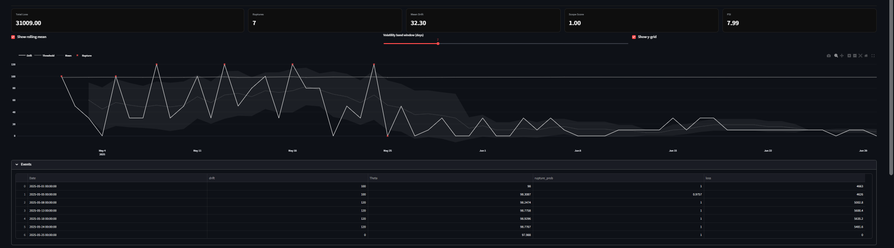

# QSI — Quantitative Stochastic Intelligence
**Systemic Drift Intelligence & Preventable Volatility Loss Management**

[Live Demo](https://rupture-detector-vxcv8twev4y3vcuqzjprnw.streamlit.app/)  

QSI tracks misalignments between forecasted expectations and realized outcomes. It quantifies volatility events where drift becomes costly, flags actionable thresholds, and estimates preventable loss. Unlike static monitoring, QSI applies stochastic intelligence: adaptive thresholds, memory-aware state tracking, and recursive correction dynamics.

**Detailed User Guide:** [Click here to access the full USER_GUIDE.md](./USER_GUIDE.md)

---

## SECTION 1 — CORE CAPABILITIES
- Upload real-world data (Excel/CSV)  
- Auto-calculate drift variables: Δ(t), E(t), Θ(t)  
- Identify volatility events when Δ(t) > Θ(t)  
- Quantify preventable financial loss  
- Visual diagnostics + downloadable reports  

---

## SECTION 2 — INSTALLATION
```bash
python -m venv venv
source venv/bin/activate   # On Windows: .\venv\Scripts\activate
pip install -r requirements.txt
```

---

## SECTION 3 — FILE STRUCTURE
```
├── qsi_core.py                          # Core intelligence engine
├── app.py                               # Streamlit frontend
├── tests/                               # Unit tests
│   └── test_qsi_engine.py
├── datasets/                            # Input datasets
│   ├── sample_supply_chain.csv
│   ├── sample_qsi_log.csv
│   ├── hyderabad_saffron_rice_supply.csv
│   └── hyderabad_saffron_rice_qsi_log.csv
├── graphs/                              # Visuals
│   ├── drift_vs_threshold.png
│   ├── boxplot_policy_vs_nonpolicy.png
│   └── boxplot_weekday_vs_weekend.png
├── USER_GUIDE.md
├── qsi_code_logic_doc.md
├── qsi_case_study.md
├── qsi_project_report.md
├── validation_report.md
├── requirements.txt
└── LICENSE.txt
```

---

## SECTION 4 — DATA FORMAT
Your input file must contain:

```
Date        YYYY-MM-DD  
Forecast    numeric  
Actual      numeric  
Unit_Cost   monetary per unit  
```

---

## SECTION 5 — RUNNING LOCALLY
```bash
streamlit run app.py
```
Loads the Streamlit interface in your browser.

---

## SECTION 6 — PARAMETERS
Configurable in-app:
- `c` — Drift amplification factor  
- `a` — Threshold sensitivity to drift  
- `Theta0` — Base rupture threshold  
- `sigma` — Volatility noise scale  
- `alpha` — EWMA smoothing factor  
- `k` — Standard deviation multiplier  

---

## SECTION 7 — OUTPUTS
- Δ(t): instantaneous drift  
- E(t): cumulative misalignment memory  
- Θ(t): dynamic rupture threshold  
- Event Table: time-stamped volatility flags + costs  
- Plots: drift vs threshold overlays  
- Aggregate preventable loss  


---

## SECTION 8 — DEPLOYMENT OPTIONS
- Streamlit Cloud  
- Docker/VM self-host  
- ERP dashboard embedding  
- Local Excel-linked monitor  

---

## SECTION 9 — EXTENSIONS
- REST API for ERP (SAP/NetSuite)  
- Email/Slack volatility alerts  
- Multi-team authentication  
- Multi-sheet ingestion  
- Real-time ingestion hooks  

---

## SECTION 10 — LICENSE
MIT License. Free for personal and commercial use with attribution.

---

## SECTION 11 — AUTHOR
**Pulikanti Sashi Bharadwaj**  
📧 bharadwajpulikanti11@gmail.com  

---

## SECTION 12 — THEORETICAL FOUNDATION
QSI operates at the intersection of **control theory, recursive computation, epistemic system design, and stochastic intelligence**. Its core is the regulation of drift under uncertainty, using feedback loops, adaptive thresholds, and memory-aware correction.  

Grounded in:  
- Dynamic feedback regulation (Kalman, Åström & Murray)  
- Recursive computability (Soare, Odifreddi)  
- Second-order observation & closure (von Foerster, Maturana, Varela)  
- Epistemic drift regulation (Pulikanti, RCC 2025)  

By embedding these traditions, QSI is not just reactive monitoring — it is a **stochastic intelligence layer** capable of sensing when internal models themselves are becoming obsolete.  

---

## SECTION 13 — FIELD IMPLEMENTATION
**Pilot Deployment:**  
[Read full case study — Rice Supply Chain (Hyderabad)](qsi_project_report.md)  

© 2025 Pulikanti Sashi Bharadwaj. Open-source licensed.  

