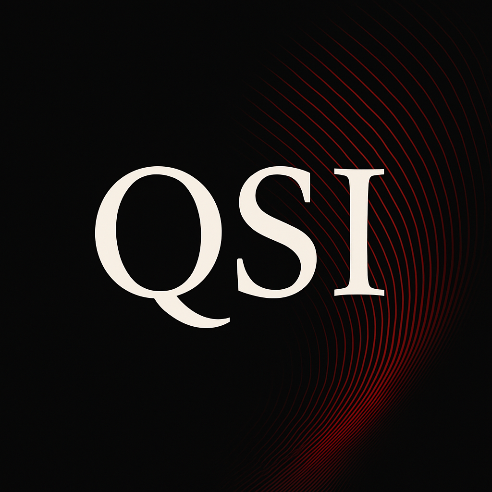
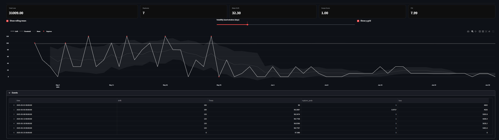

  

<h1 align="center">Quantitative Stochastic Intelligence</h1>

  Adaptive rupture detection and epistemic diagnostics for dynamic systems. 
  <strong>Policy-calibrated intelligence that learns from volatility.</strong>

  
  

---

## Overview

QSI is a **decision-intelligence engine** that detects ruptures in forecast vs. actual performance, quantifies preventable losses, and provides **epistemic diagnostics** such as drift, threshold breaches, stability scope, and policy sensitivity.  

It is designed for **board-level clarity** and **field-level adaptability**, aligning with volatile domains ranging from **supply chains** to **finance, cyber, and pharma**.  

Minimal, calibrated, and transparent — QSI surfaces actionable intelligence without black-box opacity.

---

## Features

- **Rupture Detection** — Tracks forecast vs. actual drift, thresholds, and breach events.  
- **Loss Quantification** — Converts drifts into monetary loss using unit cost.  
- **Epistemic Diagnostics** — Scope score, PSI, and breach ETA forecasting.  
- **Cognize Meta-Policy** — Optional adaptive mode with exploration and policy promotion.  
- **Segment Graphs** — Coupled dynamics across multiple SKUs or regions.  
- **Dynamic Configurability** — Every knob is exposed for user calibration, no statics hard-coded.  
- **Custom Models** — Plug in enterprise-specific threshold policies via registry.  

---

## Interface

---

## Use Cases

QSI is **domain-agnostic**. Example applications include:  

- **Supply Chains** — Prevent procurement losses by catching over/under-forecast drifts early.  
- **Finance** — Stress-test trading strategies against volatility thresholds.  
- **Healthcare & Pharma** — Detect demand misalignments in critical drug or equipment supply.  
- **Cybersecurity** — Monitor deviations in expected traffic or anomaly baselines.  
- **Operations & Strategy** — Track policy adherence, systemic drift, and rupture clusters.  

---

## Disclaimer

QSI outputs are **calibration-dependent**.  
The toggles and parameters exist for a reason: to adapt the system to the volatility profile of your domain.  
Misuse without domain calibration may lead to misleading results.  

---

