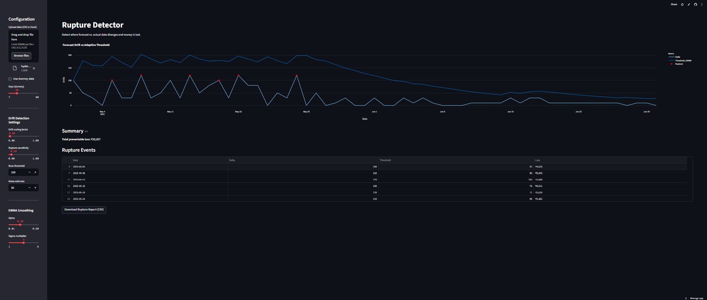

RUPTURE DETECTOR
================

Forecast Drift Monitoring & Preventable Loss Detection for Supply Chains

[Live Demo](https://rupture-detector-vxcv8twev4y3vcuqzjprnw.streamlit.app/)

This tool detects misalignments between forecasted and actual demand. It identifies rupture points where deviation becomes costly and suggests corrective resets. The system quantifies preventable monetary loss using real-time thresholds and memory-aware state tracking.

---------------------------------------------------------
SECTION 1 — FEATURES
---------------------------------------------------------

- Upload real-world data via Excel or CSV
- Auto-calculate drift: Delta(t), E(t), Theta(t)
- Detect rupture events where ∆(t) > Θ(t)
- Quantify preventable loss in monetary terms
- Visual diagnostics and downloadable output

---------------------------------------------------------
SECTION 2 — INSTALLATION
---------------------------------------------------------

Create and activate a virtual environment:

    python -m venv venv
    source venv/bin/activate     # On Windows: .\venv\Scripts\activate

Install the required packages:

    pip install -r requirements.txt

---------------------------------------------------------
SECTION 3 — FILE STRUCTURE
---------------------------------------------------------

    rupture_detector/
    ├── app.py            # Streamlit interface
    ├── rupture.py        # Core logic
    ├── requirements.txt  # Dependency list

---------------------------------------------------------
SECTION 4 — DATA FORMAT
---------------------------------------------------------

Your input file must be an Excel or CSV with the following columns:

    Date        (YYYY-MM-DD format)
    Forecast    (numeric)
    Actual      (numeric)
    Unit_Cost   (monetary per unit)

---------------------------------------------------------
SECTION 5 — RUNNING LOCALLY
---------------------------------------------------------

To start the app locally:

    streamlit run app.py

Streamlit UI will load in your browser.

---------------------------------------------------------
SECTION 6 — PARAMETERS
---------------------------------------------------------

The following parameters are adjustable in-app:

    c        - Drift amplification factor
    a        - Sensitivity of threshold to drift
    Theta0   - Base rupture threshold
    sigma    - Noise level for volatility
    alpha    - EWMA smoothing factor
    k        - EWMA standard deviation multiplier

These can be exposed to UI sliders or presets.

---------------------------------------------------------
SECTION 7 — OUTPUTS
---------------------------------------------------------

- Delta(t): instantaneous drift
- E(t): cumulative epistemic misalignment
- Theta(t): rupture threshold over time
- Rupture Table: dates and loss amounts
- Plot: Drift vs Threshold (with rupture flags)
- Total preventable monetary loss
- 

---------------------------------------------------------
SECTION 8 — DEPLOYMENT OPTIONS
---------------------------------------------------------

You can deploy on:

- Streamlit Cloud
- Self-hosted server (Docker or VM)
- Embedded inside ERP dashboards
- Local desktop usage (single-user Excel monitor)

---------------------------------------------------------
SECTION 9 — EXTENSION IDEAS
---------------------------------------------------------

- REST API integration (e.g., with NetSuite)
- Email/Slack alerts for new ruptures
- Authentication for multi-team use
- Multi-sheet ingestion
- Real-time data ingestion hook

---------------------------------------------------------
SECTION 10 — LICENSE
---------------------------------------------------------

MIT License. Free for personal and commercial use with attribution.

---------------------------------------------------------
SECTION 11 — AUTHOR
---------------------------------------------------------

Built by Pulikanti Sashi Bharadwaj

Contact: bharadwajpulikanti11@gmail.com
---------------------------------------------------------
SECTION 12 — THEORETICAL FOUNDATION
---------------------------------------------------------

This system operates at the intersection of control theory, recursive computation, epistemic systems design, and second-order cybernetics. It is not built on a single framework but draws from a distributed body of knowledge that spans the regulation of feedback, adaptation to uncertainty, and recursive self-awareness in intelligent systems.

At its foundation are concepts such as:

Dynamic feedback regulation (Kalman, Åström & Murray)

Recursive structure and computability (Soare, Odifreddi)

Second-order observation and autopoietic closure (von Foerster, Maturana & Varela)

Distortion tracking and rupture thresholds (Pulikanti)

These traditions converge around the problem of how systems perceive, model, and act upon discrepancies between expectation and reality—whether through signal filtering, logical recursion, or epistemic correction loops.

One such formulation embedded here is a symbolic control structure that employs variables for memory, distortion, and rupture—used to estimate when operational drift exceeds a tolerable threshold. This allows the system to shift from predictive to adaptive behavior under stochastic volatility.

This implementation does not rely solely on statistical forecasting or static rule sets but blends cybernetic sensing, recursive reasoning, and formal thresholding. It treats intelligence as an ongoing negotiation between internal models and emergent realities.

For select theoretical references:

Kalman, R. E. (1960). A new approach to linear filtering and prediction problems. IEEE Transactions on Automatic Control.
https://doi.org/10.1109/TAC.1960.1107752

Åström, K. J., & Murray, R. M. (2008). Feedback Systems: An Introduction for Scientists and Engineers.
https://fbswiki.org

von Foerster, H. (2003). Understanding Understanding: Essays on Cybernetics and Cognition.
https://doi.org/10.1007/978-1-4615-5889-1

Maturana, H. R., & Varela, F. J. (1980). Autopoiesis and Cognition: The Realization of the Living.
https://doi.org/10.1007/978-94-009-8947-4

Soare, R. I. (1996). Computability and Recursion. Theoretical Computer Science.
https://doi.org/10.1016/0890-5401(96)90015-7

Odifreddi, P. (1992). Classical Recursion Theory.
https://doi.org/10.1007/978-3-642-58127-0

Pulikanti, S.B. (2025). Recursion Control Calculus: A Formal Epistemic Control System for Drift Regulation under Stochastic Volatility. Zenodo.
https://doi.org/10.5281/zenodo.15730197

By grounding implementation in these theoretical lineages, the system enables the capacity for agency in uncertain conditions—not merely reacting to change, but sensing when internal framing is itself becoming obsolete.
---------------------------------------------------------
SECTION 13 — FIELD IMPLEMENTATION
---------------------------------------------------------

📄 [Read full case study](project_report_hyderabad_rice.md)
📄 [Read full RCC report](RCC_Field_Implementation_Report.md)

