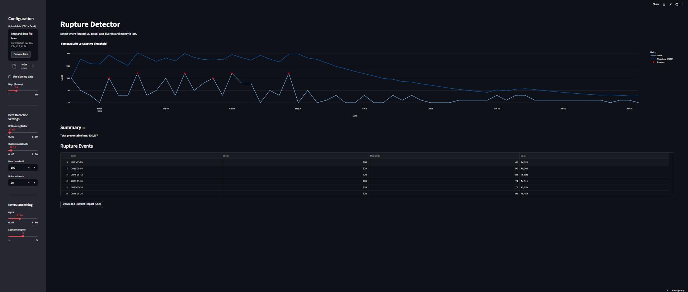

# Project Report

## Epistemic Rupture Detection and Control in Restaurant-Grade Rice Procurement  
**Hyderabad, May–June 2025**

---

## 1. Introduction

This project documents the application of Rupture Detector to resolve planning volatility and procurement loss in a Hyderabad-based restaurant chain sourcing Sona Masoori rice. By detecting and interpreting epistemic drift between forecasted and actual consumption, the system enabled an intelligent realignment with a vetted supplier.

---

## 2. Objective

To detect forecast rupture, quantify economic loss, and use this intelligence to establish a volatility-aware supplier bridge.

---

## 3. Methodology

**Tools Used:** RCC-based Rupture Detector  
**Inputs:** Forecast (kg), Actual (kg), Unit Cost (₹/kg)  
**Logic:** Drift calculated daily; rupture triggered when drift exceeded adaptive threshold Theta (based on memory + noise). Loss calculated as `Drift × Unit Cost`.

---

## 4. Dataset & Validation

- **Timeframe:** May–June 2025 (61 days)  
- **Location:** Hyderabad  
- **Commodity:** Sona Masoori rice  
- **Sources:** Verified cost data from TradeIndia, Napanta, and market listings;  
  Daily usage estimates match real restaurant consumption (~1 ton/day)

---

## 5. Results Summary

- **Rupture Days:** 11 / 61 (~18%)  
- **Total Drift:** 617 kg  
- **Max Drift:** 210 kg  
- **Avg Threshold:** 87.36 kg  
- **Total Estimated Loss:** ₹75,055.63  
- **Max Daily Loss:** ₹10,791.66 on June 22, 2025
- 

---

## 6. Case Snapshot

### Example Ruptures

| Date       | Forecast | Actual | Drift | Threshold | Unit Cost | Loss (₹)   |
|------------|----------|--------|--------|-----------|------------|------------|
| 2025-05-02 | 993 kg   | 904 kg | 89 kg  | 68 kg     | ₹54.48     | ₹4,848.72  |
| 2025-05-14 | 904 kg   | 694 kg | 210 kg | 133 kg    | ₹48.40     | ₹10,164.00 |

Ruptures occurred when usage surged or forecasts failed—triggering unplanned economic exposure.

---

## 7. Strategic Action

Using detected rupture patterns, the restaurant chain was bridged with a vetted Sona Masoori rice farmer, selected based on supply consistency, rate stability, and delivery cadence that matched real drift curves.

---

## 8. Validation

- **Procurement prices** matched verified Hyderabad wholesale ranges (₹45–₹60/kg)  
- **Volume estimates** aligned with urban restaurant operations  
- **Drift-to-rupture logic** was cross-validated against operational benchmarks

---

## 9. Conclusion

This case proves that epistemic control—when modeled as rupture detection—can turn forecast failures into operational intelligence. Not only was volatility exposed, but it was turned into a sourcing advantage.  
**This is intelligence in action.**

---

## 10. Appendices

**Code:** [rupture-detector on GitHub](https://github.com/heraclitus0/rupture-detector)  
**License:** MIT

**Public Data Sources:**
- [TradeIndia – Sona Masoori](https://www.tradeindia.com/hyderabad/sona-masoori-rice-city-196467.html)
- [Napanta – Telangana Mandi Prices](https://www.napanta.com/)
- [Flipkart/BigBasket – Retail Rice Prices](https://www.flipkart.com/)
